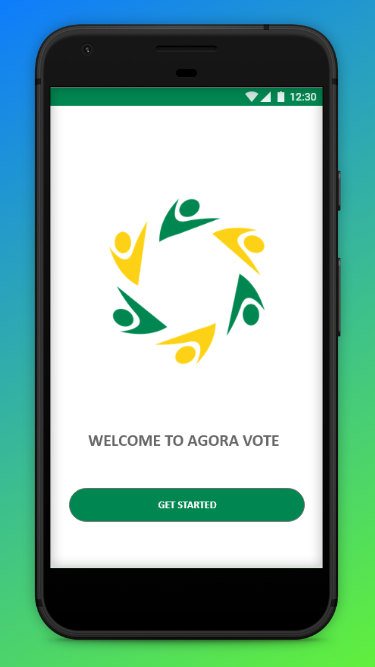
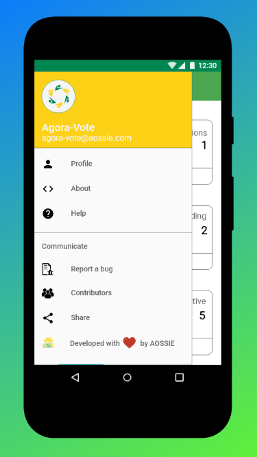

# Agora-Android

Agora-android is a android application with which users can create elections and invite friends to cast their vote .

this is just a demo project. original project is at https://gitlab.com/aossie/agora-android

## prototype 
https://xd.adobe.com/view/999dcd6f-7451-4057-611d-f7dea4d5987c-efac/

#### Designs

<table>
   <tr>
     <td><kbd></kbd></td>
     <td><kbd></kbd></td>
     <td><kbd></kbd></td>
     <td><kbd></kbd></td>
     <tr> 
      <td><kbd></kbd></td>
     <td><kbd></kbd></td>
     <td><kbd></kbd></td>
     <td><kbd></kbd></td>
    </tr>
   <tr>
     <td><kbd></kbd></td>
     <td><kbd></kbd></td>
     <td><kbd></kbd></td>
     <td><kbd></kbd></td>
     <tr> 
      <td><kbd></kbd></td>
     <td><kbd></kbd></td>
     <td><kbd></kbd></td>
     <td><kbd></kbd></td>
    </tr>
     <tr> 
     <td><kbd></kbd></td>
     <td><kbd></kbd></td>
     <td><kbd></kbd></td>
    </tr>
</table>
